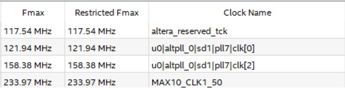

# Nios II Dhrystone benchmark

This repository contains two Nios II systems and accompanying software to 
highlight the Dhrystone MIPS performance of the Nios II/f core on a 
DE10-Lite FPGA board. 

## Hardware details

These 2 systems are:

 - minimal
 - default

"Minimal" design consists of:

 - Nios II/f core
 - JTAG UART
 - PLL
 - 64 Kb of On-Chip RAM
 - 64MB of SDRAM
 - 1ms Periodic Timer

System description:

 - The on-chip RAM has dual port slaves which allow 2 masters to access the memory 
 simultaneously. The slaves are pipelined and help in improving the system 
    performance. Each of the slaves has a read latency of 2.
 - Arithmetic operation include 3x hardware multipliers but no HW division.

"Default" design contains everything from the "minimal" Nios II system plus the following 
components:

 - Modular ADC Core
 - On-chip Flash
 - SPI Accelerometer
 - LED and Switch PIO
 - Avalon-MM Clock Crossing Bridge

VGA output for this design is just a hardcoded gradient test card controlled by Verilog.


It should be noted that "default" system uses 1-port on-chip RAM as it results in better performance.

"Minimal"system (CPU and SDRAM controller) runs at 120MHz. "Default" system runs at 100MHz. Main bottleneck of the "default" system is on-chip Flash.



Compiling these designs in Quartus Prime Lite 16.1 produces the following results:

| Model                 | f_max "minimal" | f_max "default" |
| --------------------- | --------------- | --------------- |
| Slow 1200mV 85C Model | 121.94MHz       | 113.33MHz       |
| Slow 1200mV 0C Model  | 132.07MHz       | 124.36MHz       |


## Software details

Software contains Dhrystone benchmark modified to run on Nios II CPU. Project is compiled with `-O3` and `-DREG` settings.
We run 20'000'000 iterations of the test.

## Benchmark results

As you can see below, we are getting around 110 DMIPS which is significantly better than AMD 5X86 running at 133MHz, and almost identical to Pentium running at 75MHz in term of processing power
(see [Dhrystone benchmarks](http://www.roylongbottom.org.uk/dhrystone%20results.htm) for more details).

    Microseconds to run through Dhrystone: 5
    Dhrystones per second:                 194118
    DMIPS:                                 110.483
    DMIPS/MHz Ratio:                       0.921

Intel [Performance Benchmark](doc/ds_nios2_perf-2016.06.24.pdf) from 2016 shows core performance of 0.9 DMIPS/MHz. Our 
result is a little bit better. 

Our "default" design produces results that are very close to the number from 2020 [Performance Benchmark](doc/ds_nios2_perf-2020.05.14.pdf) document, which is 0.753.

```
Microseconds to run through Dhrystone: 7
Dhrystones per second:                 127685
DMIPS:                                 72.672
DMIPS/MHz Ratio:                       0.727
```


