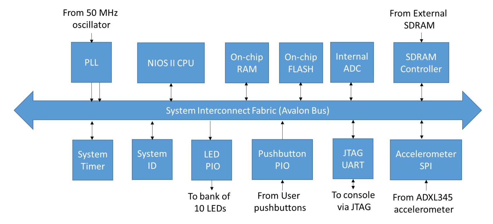

# Nios II Dhrystone benchmark

This is a test project containing basic Nios II system created in QSys for DE10-Lite FPGA board. 

This project uses the following MAX10 hard IP:

 - PLL
 - ADC
 - On-chip RAM
 - On-chip Flash
 - JTAG

VGA output is a hardcoded test card.

System runs at 100MHz.

Software portion contains Dhrystone benchmark modified to run on Nios II CPU.

## Benchmark results

As you can see below, we get 57 DMIPS which is higher than IBM486BL running with the same clock 
speed, but lower than Pentium running at 75MHz
(see [Dhrystone benchmarks](http://www.roylongbottom.org.uk/dhrystone%20results.htm) for more details).

    Microseconds to run through Dhrystone: 9
    Dhrystones per second: 100200
    DMIPS: 57.029

